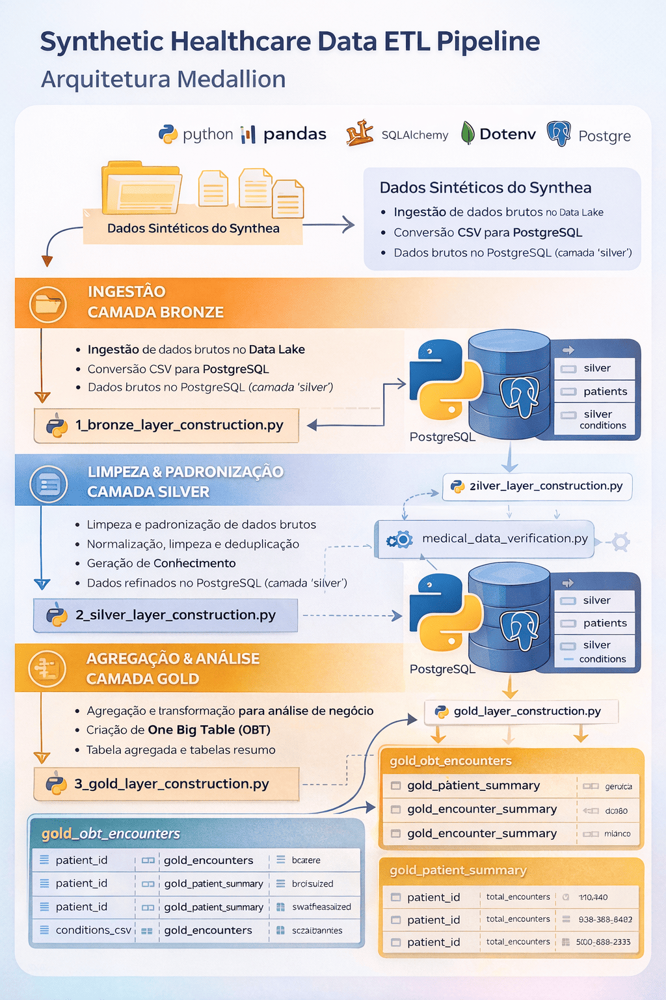

# 🧠 Synthetic Healthcare Data Pipeline

### Medallion Architecture (Bronze → Silver → Gold)

This project implements a **data engineering pipeline using the
Medallion Architecture** to process synthetic healthcare data generated
by **Synthea**.

The pipeline performs **data ingestion, transformation, validation and
analytical modeling** using Python, Pandas and PostgreSQL.

------------------------------------------------------------------------

# 🏗️ Architecture



The pipeline follows the **Medallion Architecture pattern**, separating
data processing into three layers:

CSV files (Synthea synthetic data)\
↓\
Bronze Layer --- Raw ingestion into PostgreSQL\
↓\
Silver Layer --- Data cleaning, normalization and enrichment\
↓\
Gold Layer --- Analytical tables optimized for business analysis

This structure improves:

-   Data reliability
-   Query performance
-   Data governance
-   Analytical usability

------------------------------------------------------------------------

# 🎯 Project Objective

Build a **realistic data engineering pipeline** simulating healthcare
data processing using Medallion Architecture.

The project includes:

-   ingestion of clinical data from CSV
-   structured data layering
-   data quality checks
-   analytical modeling

------------------------------------------------------------------------

# 🧰 Technologies

The pipeline was built using the following stack:

-   Python
-   Pandas
-   SQLAlchemy
-   PostgreSQL
-   Psycopg2
-   Jupyter Notebook
-   Git & GitHub

------------------------------------------------------------------------

# ⚙️ Engineering Highlights

Key engineering decisions implemented in this project:

-   Medallion Architecture (Bronze → Silver → Gold)
-   High performance ingestion using PostgreSQL COPY
-   Modular transformation scripts
-   Data quality validation checks
-   Analytical modeling with **One Big Table (OBT)**
-   Clear separation between ingestion, transformation and analytics
    layers

------------------------------------------------------------------------

# 🥉 Bronze Layer --- Data Ingestion

Script:

`1_bronze_layer_construction.py`

Responsibilities:

-   Load raw Synthea CSV datasets
-   Insert raw data into PostgreSQL

Tables created:

-   bronze_patients
-   bronze_encounters
-   bronze_conditions

The Bronze layer stores **raw, unprocessed data** for traceability.

------------------------------------------------------------------------

# 🥈 Silver Layer --- Data Cleaning & Standardization

Script:

`2_silver_layer_construction.py`

Transformations applied:

-   creation of `full_name`
-   calculation of `duration_hours`
-   normalization of fields
-   data cleaning and preparation

Tables created:

-   silver_patients
-   silver_encounters
-   silver_conditions

The Silver layer contains **clean and structured data ready for
analytics**.

------------------------------------------------------------------------

# 🥇 Gold Layer --- Analytical Modeling

Script:

`3_gold_layer_construction.py`

Outputs:

-   gold_obt_encounters
-   gold_patient_summary
-   gold_encounter_summary

Gold tables provide **business-ready datasets** optimized for analytics
and reporting.

Example outputs include:

-   One Big Table (OBT)
-   patient-level aggregated metrics
-   encounter summaries

------------------------------------------------------------------------

# ✅ Data Quality

The project includes **data quality validation** before loading curated
layers.

Validations applied:

-   null checks on critical fields
-   validation of negative values
-   integrity verification before load

Notebook used:

`medical_data_verification.ipynb`

------------------------------------------------------------------------

# ▶️ How to Run

Clone the repository:

``` bash
git clone <repo>
cd ed_prjt1
```

Install dependencies:

``` bash
pip install -r requirements.txt
```

Configure environment variables (create `.env`):

``` bash
PG_USER=
PG_PASS=
PG_HOST=localhost
PG_PORT=5432
PG_DB=
```

Run the pipeline:

``` bash
python scripts/aula_1_banco/1_bronze_layer_construction.py
python scripts/aula_1_banco/2_silver_layer_construction.py
python scripts/aula_1_banco/3_gold_layer_construction.py
```

------------------------------------------------------------------------

# 📁 Project Structure

    ed_prjt1/
    │
    ├── data/
    │
    ├── scripts/
    │   └── aula_1_banco/
    │        ├── 1_bronze_layer_construction.py
    │        ├── 2_silver_layer_construction.py
    │        ├── 3_gold_layer_construction.py
    │
    ├── docs/
    │    └── architecture_pipeline.png
    │
    ├── notebooks/
    │    └── medical_data_verification.ipynb
    │
    ├── requirements.txt
    │
    └── README.md

------------------------------------------------------------------------

# 📊 Dataset

Synthetic healthcare data generated using:

**Synthea**\
https://synthea.mitre.org/

The dataset simulates realistic patient medical records including:

-   patients
-   encounters
-   medical conditions
-   clinical attributes

------------------------------------------------------------------------

# 🚀 Future Improvements

Possible extensions to this project:

-   orchestration with **Apache Airflow**
-   transformation layer using **dbt**
-   containerization using **Docker**
-   incremental loading strategies
-   automated data quality tests

------------------------------------------------------------------------

# 👨‍💻 Author

Pedro Barbieri