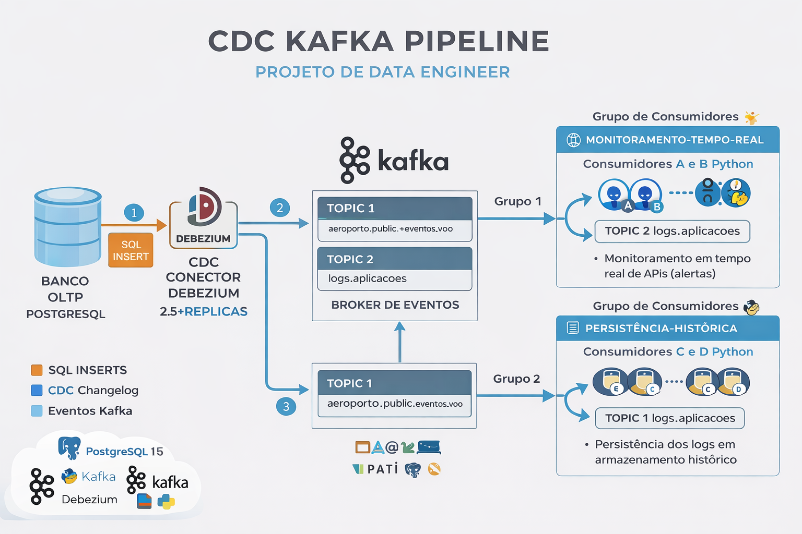

# 🚀 Real-Time Data Pipeline com Kafka e CDC (Debezium)

Projeto de engenharia de dados focado em **processamento de eventos em tempo real**, utilizando Apache Kafka e Change Data Capture (CDC) com Debezium.

---

## 🧠 Visão Geral

Este projeto simula um cenário real de engenharia de dados onde eventos são capturados diretamente de um banco transacional (OLTP) e processados em tempo real através de uma arquitetura orientada a eventos.

O pipeline permite:

- Capturar mudanças no banco PostgreSQL (CDC)
- Publicar eventos automaticamente no Kafka
- Processar logs em tempo real com múltiplos consumidores
- Simular monitoramento de APIs e persistência de dados

---

## 🏗️ Arquitetura



---

## ⚙️ Tecnologias Utilizadas

- Apache Kafka
- Zookeeper
- Debezium (CDC)
- PostgreSQL
- Docker & Docker Compose
- Python (kafka-python)
- JSON (event streaming)

---

## 🔄 Fluxo de Dados

```text
PostgreSQL (OLTP)
      ↓
Debezium (CDC)
      ↓
Kafka (Event Streaming)
      ↓
Consumers (Python)
      ↓
Monitoramento + Persistência


📦 Estrutura do Projeto

aula_5_kafka/
│
├── ambient_config/
│   └── docker-compose.yml
│
├── oltp/
│   ├── create_table.sql
│   └── insert_into.sql
│
├── scripts/
│   ├── logs_producer.py
│   ├── read_topic.py
│   ├── consumidor_A_monitoramento.py
│   ├── consumidor_B_monitoramento.py
│   ├── consumidor_C_persistencia.py
│   └── consumidor_D_persistencia.py
│
├── docs/
│   └── kafka_cdc_pipeline.png
│
└── README.md


▶️ Como Executar

1. Subir o ambiente
    cd ambient_config
    docker compose up -d

2. Criar tabelas no PostgreSQL
    docker exec -i postgres_new psql -U postgres1 -d mydb < oltp/create_table.sql
    docker exec -i postgres_new psql -U postgres1 -d mydb < oltp/insert_into.sql

3. Criar o tópico Kafka
    docker exec -it kafka kafka-topics --bootstrap-server localhost:9092 --create \
    --topic logs.aplicacoes \
    --partitions 2 \
    --replication-factor 1

4. Rodar o produtor
    python scripts/logs_producer.py

5. Rodar consumidores

Em terminais separados (split):

python scripts/consumidor_A_monitoramento.py
python scripts/consumidor_B_monitoramento.py
python scripts/consumidor_C_persistencia.py
python scripts/consumidor_D_persistencia.py


🔍 Conceitos Demonstrados

🔹 Consumer Groups
Consumidores A e B → mesmo grupo → divisão de carga
Consumidores C e D → outro grupo → recebem todos os eventos
🔹 Processamento em Tempo Real
Monitoramento de APIs
Detecção de erros e lentidão
Geração de alertas
🔹 Persistência de Dados
Armazenamento de logs para análise futura
Base para Data Lake ou Analytics
🔹 Change Data Capture (CDC)
Captura automática de mudanças no banco
Integração com Kafka via Debezium


🎯 Casos de Uso Reais

Este tipo de arquitetura é utilizado por empresas como:
Nubank
Mercado Livre
iFood
Uber
Netflix


📌 Conclusão

Este projeto demonstra na prática:

Arquitetura orientada a eventos
Processamento distribuído com Kafka
Integração entre banco de dados e streaming
Escalabilidade com Consumer Groups